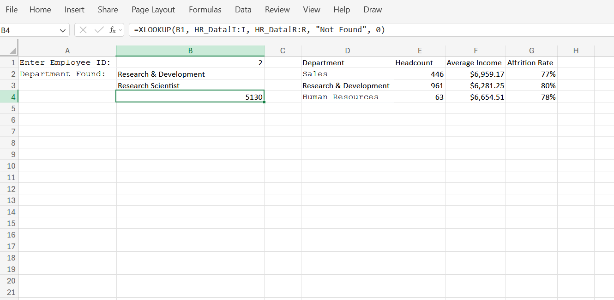
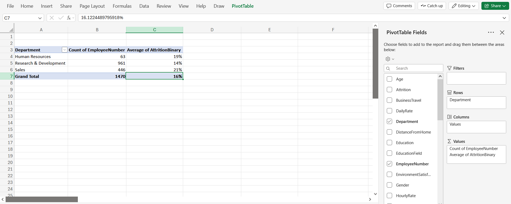
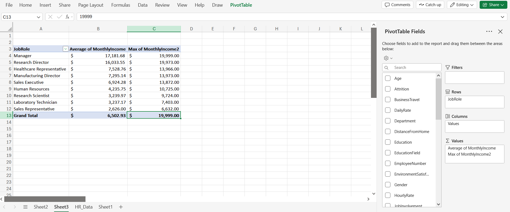

# HR Attrition Analytics — Excel Dashboard Portfolio

Welcome to my HR analytics repository! This project focuses on identifying organizational attrition drivers and salary imbalances by analyzing an IBM HR dataset containing **1,470 employee records and 35 variables**. 

Instead of relying entirely on automated business intelligence platforms, I built data cleaning pipelines, feature engineering metrics, dynamic search infrastructure, and multi-dimensional analytical views entirely within Excel.

## 🚀 Key Skills Showcased
* **Data Cleansing**: Sanitizing data profiles by identifying and removing stagnant, zero-variance columns.
* **Feature Engineering**: Utilizing conditional logical mapping to transform text metrics into binary statistical indicators.
* **Dynamic Search Frameworks**: Implementing nested array lookup functions to extract live data points on demand.
* **Aggregation Modeling**: Constructing categorical summary matrices via Pivot Tables to isolate critical business metrics.

---

## 📂 Project Workflow & Architecture

The full data pipeline is built across separate transactional layers in the [`IBM_HR_Data_Analysis.xlsx`](./IBM_HR_Data_Analysis.xlsx) workbook:

### 1. Data Sanitization & Cleaning Layer (`HR_Data`)
* Dropped columns with zero statistical variance across the entire headcount (e.g., `EmployeeCount`, `StandardHours`, and `Over18`) to optimize calculation performance.
* **Engineered Feature 1 (`AttritionBinary`)**: Used `=IF(B2="Yes", 1, 0)` to convert categorical attrition text into numerical fields, allowing for seamless rate averages.
* **Engineered Feature 2 (`IncomeBracket`)**: Implemented a nested conditional classification logic `=IF(R2<3000, "Low", IF(R2<7000, "Mid", "High"))` to segment employee compensation bands.

### 2. Live Query Search Layer (`Sheet1`)
* Created an interactive internal search dashboard utilizing the modern `=XLOOKUP` framework.
* Generates live, single-line data extractions: typing an individual `Employee ID` instantly returns their exact Department, localized Job Role, and monthly income matrix from the core data tab without executing heavy queries.

### 3. Aggregate Executive Summary Layer (`Sheet2` & `Sheet3`)
* **View 1 (Attrition Velocity)**: Aggregated overall employee headcount alongside custom `Average of AttritionBinary` metrics. This pinpointed that the **Sales** (~20.6%) and **Human Resources** (~19.0%) departments suffer from the highest turnover rates, compared to Research & Development (~13.8%).

* **View 2 (Compensation Hierarchy)**: Constructed an organizational wage matrix grouping positions by `JobRole` and tracking `Average` vs. `Maximum` incomes. This clearly ranks corporate salary floors, proving **Managers** command the highest structural averages (\$17,181.68) while **Sales Representatives** form the base (\$2,626.00).

---

## 🛠️ Environment Punctuation Note
This project was constructed in a cloud-optimized spreadsheet runtime utilizing global standardized functional separation. All formulas utilize clean comma (`,`) delimiters for compatibility across desktop and enterprise web configurations.
